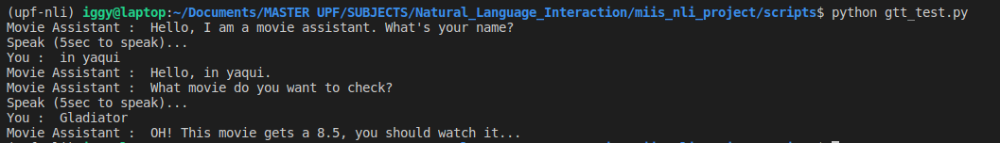

# Testing Google API for speech recognition


**Requirements**

```bash
pip install SpeechRecognition # importing speech recognition package from google api 
pip install playsound # to play saved mp3 file
pip install gTTS # google text to speech 
pip install requests # to get API responses
pip install PyAudio # to play saved mp3 file
sudo apt install python-gobject # to play saved mp3 file
sudo apt install python3-pyaudio # to play saved mp3 file
```


> Tested and working on Ubuntu 18.0.4


### Usage

```bash
git clone https://github.com/iggyrrieta/gtt_speech_recognition
```

Go to `scripts folder` and run from terminal:

```bash
python gtt_test.py
```



