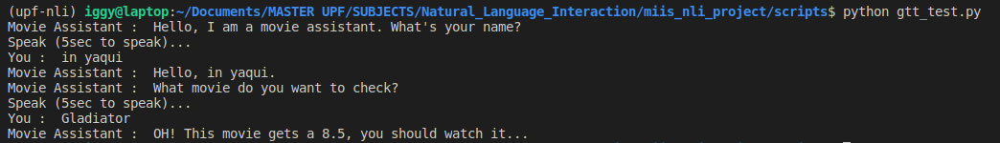

# NATURAL LANGUAGE INTERACTION

Project definition


## Install libraries

```bash
pip install SpeechRecognition
```

```
pip install playsound
```

```
pip install gTTS
```

```
pip install requestspip 
```

```
pip install PyAudio
```

```bash
sudo apt install python-gobject
```

```bash
sudo apt install python3-pyaudio
```


> Tested and working in Ubuntu 18.0.4. On MAC and Windows should be very similar


## Usage

Go to `scripts folder` and run from terminal:

```bash
python gtt_test.py
```


